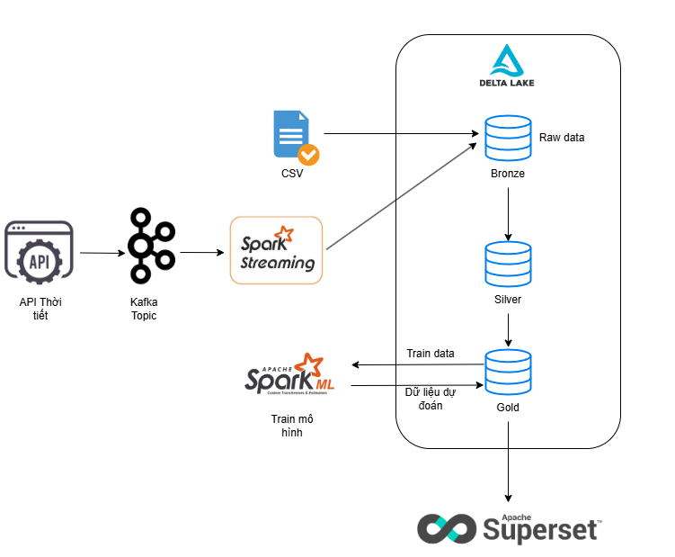

# Real-Time Weather Data Processing and Prediction System

## Project Overview

This project implements a comprehensive real-time weather data processing and machine learning prediction system using modern big data technologies. The system follows a medallion architecture (Bronze-Silver-Gold) to process streaming weather data from APIs, store it efficiently using Delta Lake, and provide real-time weather predictions using machine learning models.



## Key Features

- **Real-time Data Ingestion**: Streams weather data from Weather API using Kafka
- **Medallion Architecture**: Implements Bronze-Silver-Gold data lake pattern with Delta Lake
- **Machine Learning Pipeline**: Trains and deploys ML models for weather prediction
- **Scalable Processing**: Uses Apache Spark for distributed data processing
- **Cloud-Ready**: Supports both local deployment and cloud platforms (Databricks)
- **Containerized Services**: Docker Compose setup for easy deployment
- **Flexible Deployment**: Local Apache Kafka or managed Aiven Kafka for cloud

## Technology Stack

- **Big Data Processing**: Apache Spark, PySpark
- **Storage**: Delta Lake (ACID transactions, schema evolution)
- **Streaming**: Apache Kafka (local) / Aiven Kafka (cloud managed service)
- **Machine Learning**: Spark MLlib, Random Forest, Classification models
- **Infrastructure**: Docker, Docker Compose
- **Cloud Platforms**: Databricks, Aiven (managed Kafka)
- **Data Sources**: WeatherAPI.com
- **Languages**: Python, SQL

## System Architecture

The system follows a modern data lakehouse architecture:

### 1. Data Ingestion Layer

- **Kafka Producer** (`weather_producer.py`): Fetches real-time weather data from WeatherAPI
- **Streaming Ingestion**: Kafka consumers process data streams in real-time
- **Multiple Sources**: Supports both API streaming and batch CSV processing

### 2. Storage Layer (Delta Lake)

- **Bronze Layer**: Raw data ingestion from multiple sources
  - `from_api/`: Real-time API data
  - `from_csv/`: Batch CSV data
- **Silver Layer**: Cleaned and merged data with business logic
- **Gold Layer**: Aggregated features and ML-ready datasets

### 3. Processing Layer

- **Data Preprocessing**: Feature engineering, data cleaning, labeling
- **ML Training**: Multiple model training for different weather predictions
- **Real-time Inference**: Streaming prediction pipeline

### 4. ML Models

The system trains specialized models for:

- Temperature prediction (3-hour ahead)
- Humidity forecasting
- Wind speed and direction prediction
- Weather classification
- Precipitation forecasting
- Atmospheric pressure prediction

## Project Structure

```
code/
├── data-processing/           # Data preprocessing and feature engineering
├── kafka-streaming-data-ingest/  # Real-time data ingestion pipeline
├── quan-ly-tang-luu-tru/     # Delta Lake storage management
├── streaming-predict/         # Real-time prediction services
└── train-ml/                 # Machine learning model training

data/
└── user/delta/           # Delta Lake storage
    ├── bronze/               # Raw data layer
    ├── silver/               # Processed data layer
    ├── gold/                 # Analytics-ready data
    └── models/               # Trained ML models
```

## Key Components

### 1. Kafka Streaming Pipeline

- **Producer**: Continuously fetches weather data from external APIs
- **Consumer**: Processes streaming data into Bronze layer
- **Error Handling**: Robust error handling and data validation

### 2. Data Processing Pipeline

- **Bronze to Silver**: Data cleaning, validation, and standardization
- **Silver to Gold**: Feature engineering and ML preparation
- **Schema Evolution**: Automatic schema management with Delta Lake

### 3. Machine Learning Pipeline

- **Feature Engineering**: Creates lag features, weather indicators
- **Model Training**: Multiple specialized prediction models
- **Model Deployment**: Real-time inference capabilities
- **Model Versioning**: Automated model management

### 4. Infrastructure

- **Docker Compose**: Easy local development setup with Apache Kafka
- **Cloud Integration**: Alternative deployment with Aiven managed Kafka service
- **Monitoring**: Stream processing monitoring and alerts

## Technical Achievements

- **Scalability**: Handles high-velocity weather data streams
- **Reliability**: ACID transactions with Delta Lake ensure data consistency
- **Performance**: Optimized Spark configurations for efficient processing
- **Flexibility**: Supports multiple deployment environments
- **Monitoring**: Comprehensive logging and stream monitoring

## Data Pipeline Flow

1. **Ingestion**: Weather data streams from API → Kafka
2. **Bronze**: Raw data stored in Delta format with schema validation
3. **Silver**: Data cleaning, deduplication, and business rule application
4. **Gold**: Feature-rich datasets optimized for ML and analytics
5. **ML Training**: Automated model training on processed features
6. **Prediction**: Real-time weather prediction serving

## Skills Demonstrated

- **Big Data Engineering**: Apache Spark, Delta Lake, Kafka
- **Machine Learning**: MLlib, predictive modeling, feature engineering
- **Data Architecture**: Medallion architecture, data lake design
- **DevOps**: Docker containerization, CI/CD practices
- **Cloud Computing**: Multi-cloud deployment strategies
- **Real-time Processing**: Stream processing, real-time analytics
- **Data Quality**: Schema management, data validation, monitoring

## Business Value

- **Real-time Insights**: Immediate weather data processing and predictions
- **Cost Efficient**: Open-source stack reduces operational costs
- **Scalable**: Handles growing data volumes without performance degradation
- **Reliable**: Enterprise-grade data consistency and fault tolerance
- **Extensible**: Modular design allows easy feature additions

## Installation & Setup

1. **Prerequisites**: Docker, Docker Compose, Python 3.8+
2. **Kafka Setup**: `docker-compose up -d` in kafka-streaming-data-ingest/
3. **Spark Environment**: Configure Spark with Delta Lake extensions
4. **API Keys**: Set up WeatherAPI.com credentials
5. **Data Pipeline**: Run notebooks in sequence for data processing
6. **ML Training**: Execute training notebooks for model development

This project demonstrates expertise in modern data engineering, real-time processing, machine learning, and cloud-native architectures, making it suitable for roles in data engineering, ML engineering, and big data analytics.
